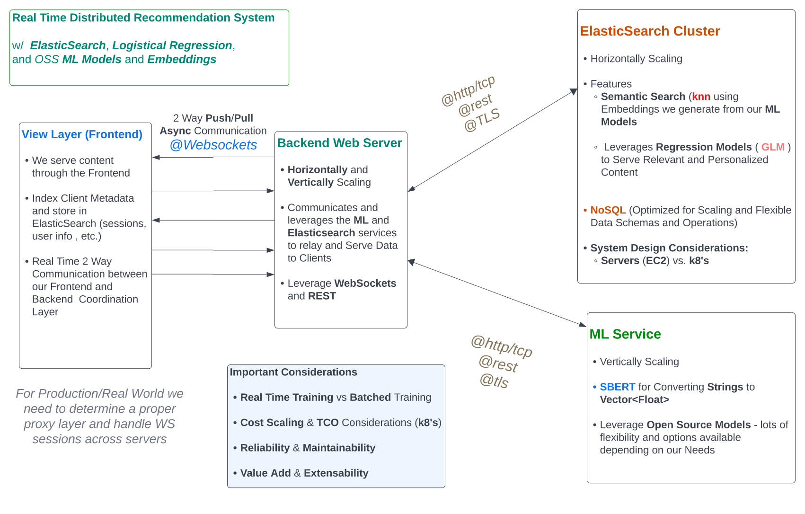

```bash
███████╗███████╗ █████╗ ██████╗  ██████╗██╗  ██╗    ███████╗██╗   ██╗███████╗████████╗███████╗███╗   ███╗███████╗
██╔════╝██╔════╝██╔══██╗██╔══██╗██╔════╝██║  ██║    ██╔════╝╚██╗ ██╔╝██╔════╝╚══██╔══╝██╔════╝████╗ ████║██╔════╝
███████╗█████╗  ███████║██████╔╝██║     ███████║    ███████╗ ╚████╔╝ ███████╗   ██║   █████╗  ██╔████╔██║███████╗
╚════██║██╔══╝  ██╔══██║██╔══██╗██║     ██╔══██║    ╚════██║  ╚██╔╝  ╚════██║   ██║   ██╔══╝  ██║╚██╔╝██║╚════██║
███████║███████╗██║  ██║██║  ██║╚██████╗██║  ██║    ███████║   ██║   ███████║   ██║   ███████╗██║ ╚═╝ ██║███████║
╚══════╝╚══════╝╚═╝  ╚═╝╚═╝  ╚═╝ ╚═════╝╚═╝  ╚═╝    ╚══════╝   ╚═╝   ╚══════╝   ╚═╝   ╚══════╝╚═╝     ╚═╝╚══════╝
                                                                                                                 
```





# Search and Recommendation Systems


- Elasticsearch - used for querying for Full-Text search - can also do Similarity Search by Storing Vectors along with the Text.

- We need to generate the Embeddings from Text - and insert them into Elasticsearch.

## Embeddings

- For Semantic Search and Similarity - we can use a couple models to achieve this.

- BERT 
  - Foundational Model
  - Is BiDirectional by nature
  - Optimized for Classification and not Similarity

- SBERT
  - Optimized for Similarity
  - Faster than BERT


- USE
  - Mix of bothh performance and speed and Versatility

## Search Concepts and Tasks

Document Reranking

- 2 Step Process 
  
  - Step i.  Perform Full Text Search within ES - to get a set of Documents

  - Step ii. Feed these documents to an ML Model - that converts it to Embeddings

     - In this step - reeorder them based on some criteria and sort them and return to User

```bash
How does Version Upgrade from ES Work?

```

### System Design

```bash
- Frontend 
- SBERT Embedder Service
- Elasticsearch Service

Frontend : User enters Data -> Opens Connection to SBERT Embedder Service 

SBERT Embedder Service : Receives Data -> Creates Embedding -> Sends to Elasticsearch Service

Elasticsearch Service : Receives Embedding -> Uses Embedding to Query ES -> Returns Response to Websockets SBERT

SBERT Embedder Service : Receives Response -> Sends to Frontend

```

### Document Reranking

- User performs Search - gets initial set of Documents

- Then we calculate Similarity Between the Query and Set of Documents

- Then return Results of Documents that are most similar to the Query

